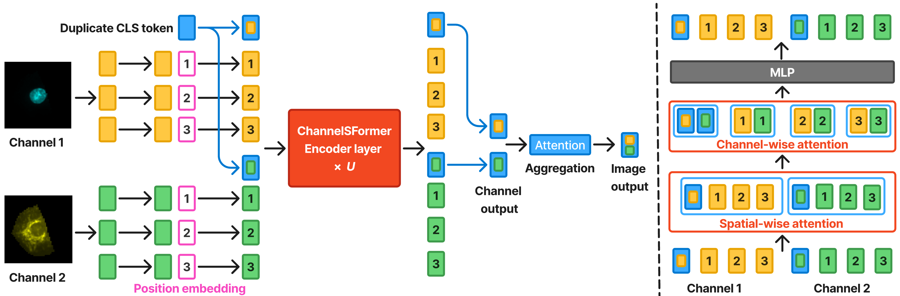

# ChannelSFormer

[](https://creativecommons.org/licenses/by-nc-sa/4.0/)
[](https://www.python.org/downloads/release/python-3110/)

**ChannelSFormer: A Channel Agnostic Vision Transformer for Multi-Channel Cell Painting Images**



## Overview

ChannelSFormer is a Vision Transformer architecture designed for multi-channel microscopy images (e.g., Cell Painting with 5+ channels). Unlike standard ViT models that treat RGB images, ChannelSFormer processes each channel independently through divided space-channel attention, enabling flexible handling of varying numbers of input channels.

### Key Features

- **Divided Space-Channel Attention**: Separates spatial and channel-wise attention mechanisms
- **Channel-Agnostic Design**: Handles variable numbers of input channels without architecture changes
- **Flexible CLS Token Handling**: Supports shared or separate classification tokens per channel
- **Multiple Attention Orders**: Channel-first, space-first, or parallel processing
- **Optional Channel Embeddings**: Learnable embeddings to distinguish between different input channels

## Installation

### Requirements

- Python >= 3.11, < 3.12
- PyTorch >= 2.8 (with CUDA 12.6)
- [Pixi](https://pixi.sh/) package manager

### Setup with Pixi

```bash
# Install pixi (if not already installed)
curl -fsSL https://pixi.sh/install.sh | bash

# Install dependencies
pixi install
```

## Usage

### Training

#### ImageNet Training

```bash
# Single-node, 8-GPU training
torchrun --standalone \
    --nnodes=1 \
    --nproc-per-node=8 \
    ./channelsformer/main.py \
    --cfg ./channelsformer/configs/imagenet/channelsformer_tiny.yaml \
    --dataset imagenet \
    --data-path /path/to/imagenet.parquet \
    --batch-size 128 \
    --output ./output/channelsformer_tiny \
    --project channelsformer_imagenet \
    --tag channelsformer_tiny \
    --wandb true
```

#### JUMP-CP Training (Multi-Channel Cell Painting)

```bash
torchrun --standalone \
    --nnodes=1 \
    --nproc-per-node=8 \
    ./channelsformer/main.py \
    --dataset jumpcp \
    --data-path s3://path/to/jumpcp/data.pq \
    --cfg ./channelsformer/configs/jumpcp/channelsformer_tiny.yaml \
    --batch-size 32 \
    --model_ema_decay 0.9990 \
    --output ./output/channelsformer_jumpcp \
    --project channelsformer_jumpcp \
    --tag channelsformer_tiny \
    --wandb true
```

### Using Pre-configured Scripts

The repository includes ready-to-use training scripts:

```bash
# ImageNet
bash ./channelsformer/scripts/imagenet/1_channelsformer_tiny.sh

# JUMP-CP
bash ./channelsformer/scripts/jumpcp/1_channelsformer_tiny_bs256.sh
```

### Configuration

Model configurations are defined in YAML files under [channelsformer/configs/](channelsformer/configs/). Key parameters:

```yaml
MODEL:
  TYPE: channelsformer
  CHANNELSFORMER:
    IN_CHANS: 8                              # Number of input channels
    EMBED_DIM: 192                           # Embedding dimension
    NUM_HEADS: 3                             # Number of attention heads
    ATTENTION_TYPE: 'divided_space_channel'  # Attention mechanism
    USE_CHANNEL_EMBEDDING: false             # Enable channel embeddings
    SEPARATE_CLS_FOR_CHANNEL: true           # Separate CLS token per channel
    SEPARATE_CLS_AGGREGATION: 'att'          # CLS aggregation method (att/mean)
    SPACE_CHANNEL_ORDER: 'space_first'       # Attention order
```

## Testing

Run the test suite:

```bash
# Run all tests
pytest tests/

# Run specific test file
pytest tests/test_channelsformer.py -v

# Run with coverage
pytest tests/ --cov=channelsformer
```

## Data Format

The data loaders expect Parquet files with the following structure:

### ImageNet
```
path | label
-----|------
/path/to/img1.jpg | 0
/path/to/img2.jpg | 1
```

### JUMP-CP
```
path | ID | well_loc | plate | field | ...
-----|----|---------| ------|-------|----
s3://... | 0 | A01 | BR00116991 | 1 | ...
```

## Citation

If you use this code in your research, please cite:

```bibtex
@article{channelsformer2025,
  title={ChannelSFormer: A Channel Agnostic Vision Transformer for Multi-Channel Cell Painting Images},
  author={Zhang, Jingwei and Sivanandan, Srinivasan},
  year={2025}
}
```

## License

This project is licensed under the Creative Commons Attribution-NonCommercial-ShareAlike 4.0 International License - see the [LICENSE.md](LICENSE.md) file for details.

## Acknowledgments

This implementation builds upon:
- [Swin Transformer](https://github.com/microsoft/Swin-Transformer) codebase
- [timm](https://github.com/huggingface/pytorch-image-models) library
- [PyTorch](https://pytorch.org/)


